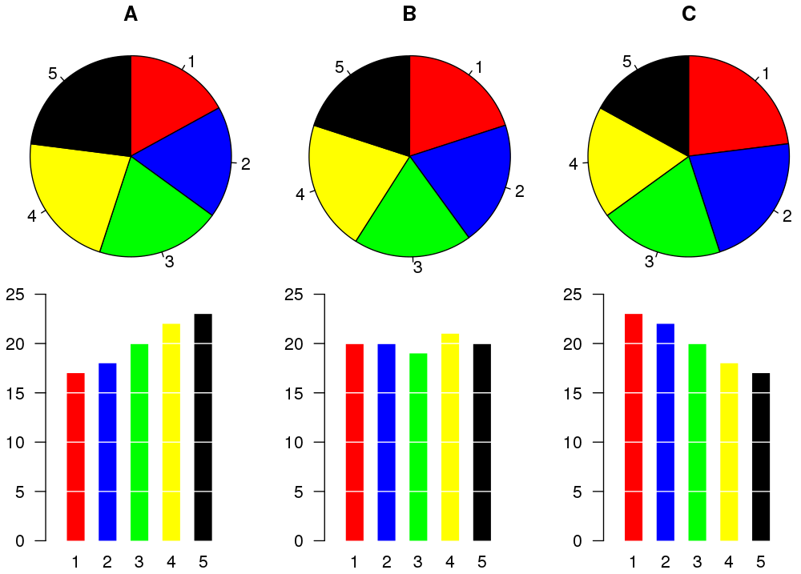
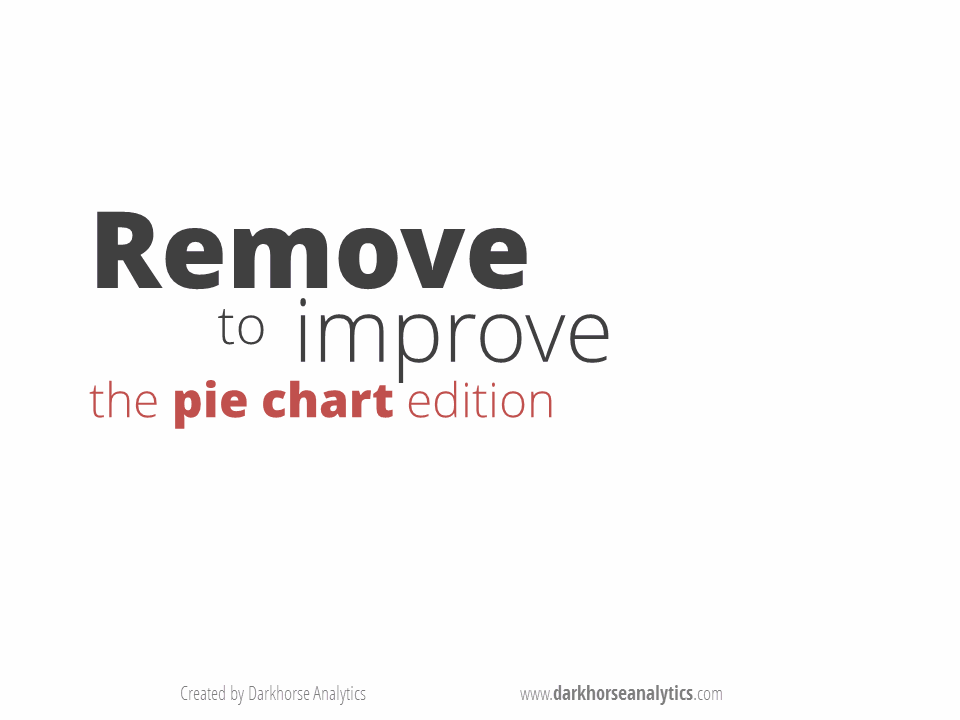
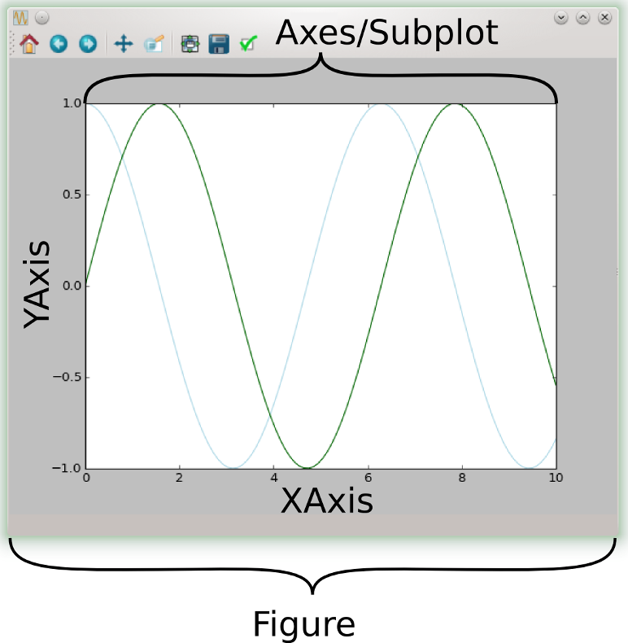

# Intro to Plotting, Matplotlib, and Seaborn

Over the last week, we've discussed how to use Python to create programs and Pandas to analyze data with summary statistics like mean and standard deviation. Plotting data can also be a powerful tool to understand how data is distributed and bivariate relationships.

Within Python, the primary plotting library is known as Matplotlib. First released in 2003, it is an adaptation of Matlab style plotting techniques to Python. This means that it can be a little opaque and complex in how its operation. However, working together, we'll learn pretty quickly how to start plotting data.

## The Data

We'll start by doing some quick data analysis, split by market. Open a jupyter notebook in your home directory and download the following data:

- [Atlanta Data](./datasets/data_atlanta.csv)
- [Austin Data](./datasets/data_austin.csv)
- [Boston Data](./datasets/data_boston.csv)
- [Chicago Data](./datasets/data_chicago.csv)
- [New York City Data](./datasets/data_nyc.csv)

Each dataset has an `x` column and a `y` column -- spend a few minutes exploring this data!

## Basics of Plotting

Typically, we're going to choose between one of several types of plots when trying to visually display information. 

| Name | Columns | Description | Strengths | Weaknesses |
| --- | --- | --- | --- | --- |
| Bar | 1 | Shows values split by categories | Easy comparison across groups | Multiple categories can be hard to read and scaling / ordering can be tricky |
| Box | 1 | Shows data distribution for one set of data | Highlights outliers well | Can hide distribution within IQR |
| Histogram | 1 | Shows data distribution for one set of data | Potentially more truthful distribution versus Box | Bin size can dramatically affect results |
| Line | 2 | Shows changes in one value versus another | Easily show trends over some value | Requires meaningfully sorted data |
| Scatter | 2 | Compares pairwise relationships | Intuitive visualization | Scale and density affect quality |

## Checklist for Good Plots

- [ ] Include title
- [ ] Include x-axis and y-axis label
- [ ] Appropriate type of plot
- [ ] If there is color, it is used appropriately
  - [ ] Not too many colors (to avoid confusion)
  - [ ] Colorblind readers taken into account
- [ ] When necessary, include a legend
- [ ] Data is shown as accurately / truthfully as possible
- [ ] Chart tells *one* story 
- [ ] *One* set of axes
- [ ] Information per ink ratio is maximized (Tufte)

## The Golden Rule: No Charts Named After Desserts

- No Pie Charts
- No Donut Charts
- No Exploding Variants of either of those!

Why? Ultimately it comes down to the our ability as humans to correctly gauge the relative areas of circles (or portions of circles) -- it turns out that we are very bad at doing that!



In the example above, three pie charts look almost indistinguishable from each other, yet they represent very different distributions of data. This can be alleviated if you include the percentage that each slice represents, but even that data can be more easily shown as a bar chart instead of a pie chart. 



## Examples of Bad Plots


# Matplotlib

A basic example of Matplotlib code is below:
```python
import matplotlib.pyplot as plt     # import matplotlib libary
x = [1,2,3,4]                       # define some data
y = [20, 21, 20.5, 20.8]
plt.plot(x, y)                      # plot a line graph
plt.savefig('graph1.png')           # save figure to file
```

## Things to check when you make a graph in matplotlib:

- [ ] Do you have the right number of columns for your plot? 
  - [ ] 1 column of data: 
    - Bar: `plt.bar()` (note, will require an argument for where each bar should go -- this can be as simple as `plt.bar(range(len(data)), data)`)
    - Box: `plt.boxplot()`
    - Histogram: `plt.hist()` 
  - [ ] 2 columns of data (x column followed by y column): 
    - [ ] Line: `plt.plot()`
    - [ ] Scatter: `plt.scatter()`
- [ ] Are your data the same length?
- [ ] Do you have any nulls?
- [ ] Is every value numeric?
- [ ] Is it ordered in the correct fashion (i.e., do pairs line up together? If you have order-dependent data, such as for a line plot, is it correctly ordered?)

Matplotlib works by setting up a few different levels of the plot. From biggest to smallest, they are:

- `Figure`: The entire area that you are creating the graph on
- `Axes`: This is where you plot data and draw ticks, labels, etc.
  - `Subplot`: A figure will contain 1 and potentially more than 1 `Subplot`s -- with one graph, a `Subplot` and `Axes` are synonymous. 
- `XAxis` / `YAxis`: These contain the actual ticks, data limits, etc. 



So, let's (a bit laboriously) go through a full generation of a graph:

If you are in a jupyter notebook, the magic ipython command `%matplotlib inline` will display your graph under the cell you have produced. Without this, the image will not show up!

```python
import matplotlib.pyplot as plt 
%matplotlib inline 
fig = plt.figure() # Instantiates a figure, which will be empty
ax = fig.add_subplot(1, 1, 1) # Adds a subplot (read, axes) to the figure

## We can set a lot of different aspects of the graph by calling methods on the axes
ax.set_xlim([0.5, 4.5]) # Set the minimum and maximum of x-axis to be 0.5 and 4.5
ax.set_ylim([5, 32]) # Set the min and max of the y-axis. Minimum value comes first, followed by the maximum
ax.set_title('An Example Graph') # Set the title of the graph. If left blank, there won't be a title
ax.set_ylabel('This is my y-axis') # Set the label on the y-axis. 
ax.set_xlabel('Hey look at dis x-axis!') # and on the x-axis

## Now we'll plot a few different things!

# With matplotlib, we feed in (usually) two lists of numbers. The first list is the x-coordinates of each point
# The second list is the coordinates of each point
# So in the below case, the first bar (0th index) sits at:
# (0, 15) -> 0 on the x-axis, height of 15.

ax.bar([0, 1, 2, 3], [15, 30, 6, 8], color='purple') # Plot 4 bars on Axes. 

## We can ask Python to show us the graph, but if we're in a script, it's usually easier to have it save to file and look at it that way

plt.savefig('bar_chart.png') # Save current figure to current working directory

# We'll plot a line graph next -- just like with bar graphs, this is in [X-coordinates], [Y-coordinates] format

# the first point is (1, 10) or 1 on the x-axis and 10 on the y-axis

ax.plot([1, 2, 3, 4], [10, 20, 25, 30], color='lightblue', linewidth=3) 

# Let's see our work!

plt.savefig('line_graph_too.png')

# Until we clear out the current graph from memory, we'll keep adding stuff on top of it.
# Finally, we'll add a scatter plot

ax.scatter([4.2, 3.8, 2.5, 3.5], [11, 25, 9, 26], color='darkgreen', marker='^') # Plot scatter points on Axes
plt.savefig('final_graph.png')

# How do we clear out the current graph?

plt.clf()
```

## Subplot 111?

Matplotlib, being a (very) mature library, has a few design decisions that aren't apparent at first glance. The line `ax = fig.add_subplot(1, 1, 1)` is one of those lines -- what does `1, 1, 1` mean here?

From the documentation (reading technical documentation is a skill!)

> Typical call signature:
>
> `subplot(nrows, ncols, plot_number)`
> Where nrows and ncols are used to notionally split the figure into nrows * ncols sub-axes, and plot_number is used to identify the particular subplot that this function is to create within the notional grid. plot_number starts at 1, increments across rows first and has a maximum of nrows * ncols.
>
> In the case when nrows, ncols and plot_number are all less than 10, a convenience exists, such that the a 3 digit number can be given instead, where the hundreds represent nrows, the tens represent ncols and the units represent plot_number.

- [Relevant Documentation](http://matplotlib.org/api/pyplot_api.html#matplotlib.pyplot.subplot)

Let's test this out:

```python
fig = plt.figure()

# Plot 1st plot on 1 column, 2 row canvas

ax1 = fig.add_subplot(2, 1, 1)
ax1.plot([1, 2, 3, 4], [4, 6, 8, 10])

ax2 = fig.add_subplot(2, 1, 2)
ax2.scatter([2, 8, 10, 20], [-1, 10, -5, 6])

plt.savefig('testing_subplots.png')
```

## Plotting Resources

Resources:
- [AnatomyOfMatplotlib](https://github.com/WeatherGod/AnatomyOfMatplotlib) -- Great, great resource to learn the anatomy of Matplotlib
- [Matplotlib Tutorial](http://www.labri.fr/perso/nrougier/teaching/matplotlib/) -- Really good and quick introduction to Matplotlib

## Demo / Guided Practice: Seaborn

Some of the features that Seaborn offers are:

- Several built-in themes that improve on the default matplotlib aesthetics
- Tools for choosing color palettes to make beautiful plots that reveal patterns in your data
- Functions for visualizing univariate and bivariate distributions or for comparing them between subsets of data
- Tools that fit and visualize linear regression models for different kinds of independent and dependent variables
- Functions that visualize matrices of data and use clustering algorithms to discover structure in those matrices
- A function to plot statistical timeseries data with flexible estimation and representation of uncertainty around the estimate
- High-level abstractions for structuring grids of plots that let you easily build complex visualizations

Here's an example of Seaborn code
```python
import seaborn as sns         #by convention seaborn is abbreviated sns on import
sns.set_style('whitegrid')
```

Don't have seaborn installed? Run `conda install seaborn` on the command line

Now let's use Seaborn to take a cursory look at the iris data set.

```python
iris = sns.load_dataset("iris")
plot = sns.pairplot(iris, hue="species")
plot.savefig('pairplot.png')
```

Here we can see different levels of categorical variable by color.

You should notice some similar methods here: we still have a `savefig()` method and instead of calling `plt.SOMEPLOTTINGMETHOD()` we're calling `sns.SOMEPLOTTINGMETHOD()`. Under the hood, Seaborn is taking care of a lot of the things that we'd have to handle manually, but it's still using matplotlib as we approached it earlier. 