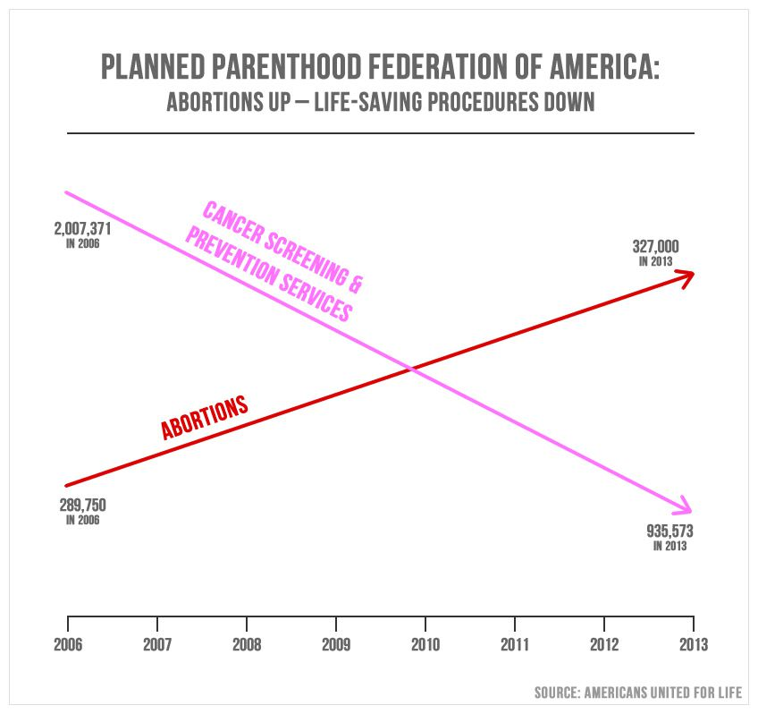

# Intro to Plotting, Matplotlib, and Seaborn

Over the last week, we've discussed how to use Python to create programs and Pandas to analyze data with summary statistics like mean and standard deviation. Plotting data can also be a powerful tool to understand how data is distributed and bivariate relationships.

Within Python, the primary plotting library is known as Matplotlib. First released in 2003, it is an adaptation of Matlab style plotting techniques to Python. This means that it can be a little opaque and complex in how its operation. However, working together, we'll learn pretty quickly how to start plotting data.

## The Data

We'll start by doing some quick data analysis, split by market. Open a jupyter notebook in your home directory and download the following data:

- [Atlanta Data](./datasets/data_atlanta.csv)
- [Austin Data](./datasets/data_austin.csv)
- [Boston Data](./datasets/data_boston.csv)
- [Chicago Data](./datasets/data_chicago.csv)
- [New York City Data](./datasets/data_nyc.csv)

Each dataset has an `x` column and a `y` column -- spend a few minutes exploring this data!

## Basics of Plotting

Typically, we're going to choose between one of several types of plots when trying to visually display information. 

| Name | Columns | Description | Strengths | Weaknesses |
| --- | --- | --- | --- | --- |
| Bar | 1 | Shows values split by categories | Easy comparison across groups | Multiple categories can be hard to read and scaling / ordering can be tricky |
| Box | 1 | Shows data distribution for one set of data | Highlights outliers well | Can hide distribution within IQR |
| Histogram | 1 | Shows data distribution for one set of data | Potentially more truthful distribution versus Box | Bin size can dramatically affect results |
| Line | 2 | Shows changes in one value versus another | Easily show trends over some value | Requires meaningfully sorted data |
| Scatter | 2 | Compares pairwise relationships | Intuitive visualization | Scale and density affect quality |

## Checklist for Good Plots

- [ ] Include Title
- [ ] Include x-axis and y-axis label
- [ ] Appropriate Type of Plot
- [ ] If there is color, it is used appropriately
  - [ ] Not too many colors (to avoid confusion)
  - [ ] Colorblind readers taken into account
- [ ] When necessary, include a legend
- [ ] Data is shown as accurately / truthfully as possible
- [ ] Chart tells *one* story 
- [ ] *One* set of axes
- [ ] Information per ink ratio is maximized (Tufte)

## Examples of Bad Plots

